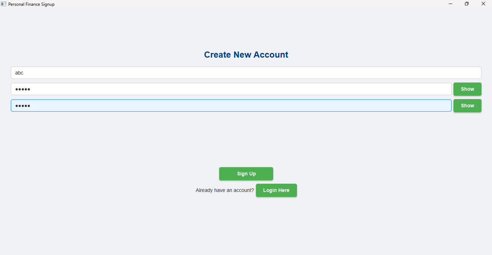

# AI-Based Personal Finance Management System

## Project Overview
This is a desktop application developed with JavaFX that provides a comprehensive solution for personal finance management. It allows users to track income and expenses, set budgets, manage multiple accounts and custom categories, visualize financial data through interactive charts, and even predict future expenses using AI (Weka). The system also includes an administrator panel for user management and global application insights.

## Features
User Authentication: Secure Login and Signup functionalities.

Multi-User Support: Each user has their own private financial data.

## Dashboard Overview:

Current month's total income, expenses, and net balance.

AI-powered prediction of next month's expenses by category.

## Interactive charts:

Pie Chart: Breakdown of expenses by category.

Bar Chart: Monthly expense comparison over time.

Line Chart: Expense trends over time.

## Transaction Management:

Add, Edit, and Delete financial transactions.

Assign transactions to specific accounts and categories.

## Budgeting:

Set monthly budget limits for specific expense categories.

Track spending against budgets with real-time status updates (On Track, Nearing Limit, Over Budget).

## Account Management:

Add, Edit, and Delete multiple financial accounts (e.g., Checking, Savings, Credit Card, Cash).

View current balances for each account.

## Category Management:

Create, Edit, and Delete custom income and expense categories.

System-defined default categories.

## Administrator Panel:

Dedicated dashboard for admin users (gaurav).

### User Management: Register new admins, toggle user admin status, delete users (with associated data cleanup).

### Global Data View: View all transactions and budgets across all users.

### Global Statistics: Overall application metrics like total users, total transactions, aggregated income/expenses, and top expense categories across the entire user base.

Responsive UI: Layouts designed to adapt and scroll to prevent crowding.

Currency Support: Displays amounts in Indian Rupees (₹).

## Technologies Used
Backend & UI: Java 17+ (or compatible JDK version)

Framework: JavaFX

Database: MySQL 8.0+

AI/Machine Learning: Weka 3.8.6 (or compatible version)

Dependency Management: Standard Java JARs (managed manually or via build tool like Maven/Gradle if implemented, currently manual for simplicity)

## Prerequisites
Before you begin, ensure you have the following installed:

Java Development Kit (JDK): Version 17 or higher.

Download JDK

MySQL Server: Version 8.0 or higher.

Download MySQL Community Server

MySQL Workbench (Recommended): For easy database management.

Download MySQL Workbench

IntelliJ IDEA (Recommended IDE): Community or Ultimate edition.

Download IntelliJ IDEA

## Setup Instructions
1. Project Structure
Ensure your project structure matches the following (or similar if using a build tool):

FinanceManagementSystem/
├── lib/
│   ├── mysql-connector-java-8.0.28.jar  # (Or your specific MySQL Connector version)
│   ├── weka-stable-3.8.6.jar            # (Or your specific Weka version)
│   └── fx-glyphs-fontawesome-8.0.7.jar  # (OPTIONAL: Only if you want font-based icons, else use simple buttons)
├── src/
│   └── main/
│       ├── java/
│       │   └── com/
│       │       └── financeapp/
│       │           ├── Main.java
│       │           ├── controller/
│       │           │   ├── AccountFormController.java
│       │           │   ├── AdminDashboardController.java
│       │           │   ├── BudgetFormController.java
│       │           │   ├── CategoryFormController.java
│       │           │   ├── DashboardController.java
│       │           │   ├── LoginController.java
│       │           │   ├── SignupController.java
│       │           │   └── TransactionFormController.java
│       │           ├── dao/
│       │           │   ├── AccountDAO.java
│       │           │   ├── BudgetDAO.java
│       │           │   ├── CategoryDAO.java
│       │           │   ├── DatabaseConnection.java
│       │           │   ├── TransactionDAO.java
│       │           │   └── UserDAO.java
│       │           ├── model/
│       │           │   ├── Account.java
│       │           │   ├── Budget.java
│       │           │   ├── Category.java
│       │           │   ├── Transaction.java
│       │           │   └── User.java
│       │           └── utils/
│       │               ├── AlertUtil.java
│       │               ├── SessionManager.java
│       │               └── WekaPredictor.java
│       └── resources/
│           ├── com/
│           │   └── financeapp/
│           │       └── view/
│           │           ├── AccountForm.fxml
│           │           ├── AdminDashboard.fxml
│           │           ├── BudgetForm.fxml
│           │           ├── CategoryForm.fxml
│           │           ├── Dashboard.fxml
│           │           ├── Login.fxml
│           │           ├── Signup.fxml
│           │           └── TransactionForm.fxml
│           └── css/
│               └── styles.css
└── sql/
    └── schema.sql

2. Database Setup
Start MySQL Server.

Open MySQL Workbench (or your preferred MySQL client).

Execute the SQL Schema:

Crucial: First, drop any existing database named finance_app_db to ensure a clean slate:

3. Configure External Libraries (JARs) in IntelliJ IDEA
Your project needs the MySQL Connector, Weka, and potentially JavaFX Font-Glyphs (if you reverted to using icons instead of text buttons).

### Download JARs:

MySQL Connector: https://dev.mysql.com/downloads/connector/j/ (Download the Platform Independent ZIP/TAR.GZ, extract, find the .jar file, e.g., mysql-connector-java-8.0.28.jar).

Weka: https://www.cs.waikato.ac.nz/ml/weka/downloading.html (Download the "stable version" JAR, e.g., weka-stable-3.8.6.jar).

FX-Glyphs-FontAwesome (Optional): https://mvnrepository.com/artifact/de.jensd/fx-glyphs-fontawesome (Download version 8.0.7's JAR if you intend to use FontAwesome icons, otherwise, you don't need this).

Place JARs in lib/: Create a lib folder in your FinanceManagementSystem project root if it doesn't exist, and place all downloaded JARs inside it.

Add to IntelliJ Project Structure:

Open your FinanceManagementSystem project in IntelliJ.

Go to File > Project Structure... (Ctrl+Alt+Shift+S on Windows/Linux, ⌘; on macOS).

In the left sidebar, select Modules.

In the center pane, select your main project module (e.g., FinanceManagementSystem).

Go to the Dependencies tab.

Click the + button on the right side and choose JARs or Directories....

Navigate to your FinanceManagementSystem/lib/ folder, select all the .jar files you placed there (MySQL Connector, Weka, FontAwesome if applicable), and click OK.

Ensure their scope is set to Compile (usually default).

Click Apply, then OK.

4. Build and Run the Application
Clean and Rebuild Project: In IntelliJ, go to Build > Clean Project, then Build > Rebuild Project. This ensures all changes are compiled.

Run Main.java: Locate src/main/java/com/financeapp/Main.java. Right-click on it and select Run 'Main.main()'.

The application's login screen should now appear.

## Testing as a Regular User (abc)
Login
Dashboard - Overview Tab:

Observe "Your Financial Snapshot" with current month's income, expenses, net balance (should be dynamic based on transactions).

Check "Predicted Next Month Total Expenses" and its "Breakdown by Category".

Verify all three charts (Expense Categories Breakdown Pie Chart, Monthly Expenses Comparison Bar Chart, Expense Trends Over Time Line Chart) are populated with realistic data and display correctly.

Crucially, test the scrollability if you resize the window to be smaller vertically. The content should fit without crowding.

Transactions List Tab:

View the extensive list of dummy transactions.

Use "Add New", "Edit Selected", "Delete Selected" buttons. Ensure new transactions are added to accounts and reflect in the "Overview" tab's summary and charts.

Budgeting Tab:

Review existing budgets. Observe "Spent", "Remaining", and "Status" (On Track, Nearing Limit, Over Budget).

Add, edit, and delete budgets. Test interaction with transactions (e.g., adding an expense that goes over budget).

Accounts Tab:

View Cash, Main Checking, Savings, Credit Card accounts. Check their Initial Bal. and Current Bal.

Add a new account, then try deleting an account that has associated transactions (should prevent deletion).

Categories Tab:

View existing categories.

Add custom categories. Try deleting default categories or categories linked to transactions/budgets (should prevent deletion).

Logout: Click the "Logout" button.

Testing as an Administrator User (gaurav)
Login: Use gaurav / gaurav1234. Verify you land on the "Admin Dashboard".

User Management Tab:

View all users (ayushmaan, gaurav, and any testuser you created).

Register New Admin: Test creating another admin user.

Toggle Admin Status: Try changing ayushmaan's admin status. Observe the change. Try changing gaurav's own status (should be prevented).

Delete User: Test deleting a regular user (like testuser if you made one). Verify all their data is removed. Try deleting gaurav's own account (should be prevented).

All Transactions Tab:

View a comprehensive list of all transactions from all regular users (primarily ayushmaan's data).

Verify Username, Account, Category columns display names correctly.

All Budgets Tab:

View all budgets from all regular users.

Verify Username and Category columns display names correctly.

Global Statistics Tab:

Observe "Overall Application Statistics": Total Registered Users, Total Transactions Recorded, Overall Income, Overall Expenses, Avg. Transactions Per User. These should reflect the aggregate data from ayushmaan and any other regular users.

Check "Top Expense Categories" across all users.

Test scrollability on this tab if the window is smaller.

Logout: Click the "Logout" button.

## Feel free to reach out if you encounter any specific issues!
